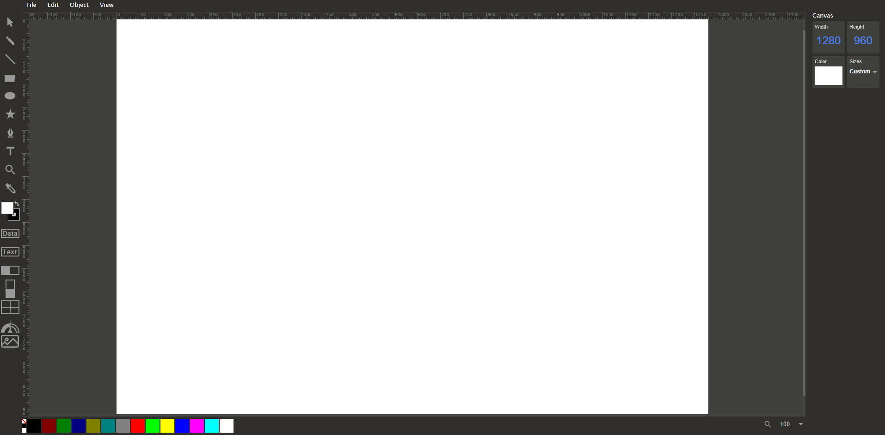

# SCADA-system

This SCADA system has the following features.

* Project Oriented
* Edit mode & Display mode
* Message transmission based on CGI (Common Gateway Interface)
* Elements & Library manipulation
* Datapoint & Action binding
* Device status mapping & controling
* Graphical Indication customizing
  
This App was developed based on https://github.com/methodofaction/Method-Draw

